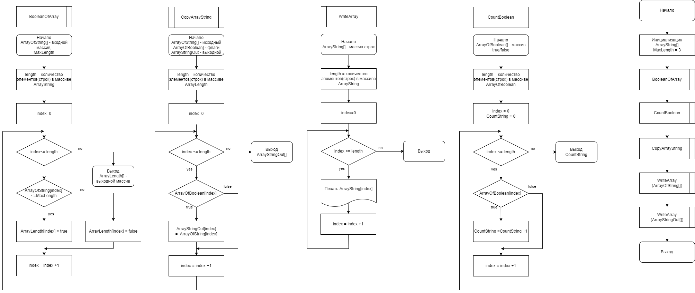

## Описание алгоритма
Программа будет включать два основных метода
Методы представлены на рисунке

# Метод 1
Метод получает на вход массив строк и 
создает массив  положительных чисел, каждое значение которого равно числу символов в соответствующей строке.

# Метод 2
Метод используется для отображение на экране строк, количество символов в которых менее заданного значения (по условию - трех)

# Метод 3
Метод используется для отображения на экране строк исходного массива, количество символов в которых не превышает заданного значения.
